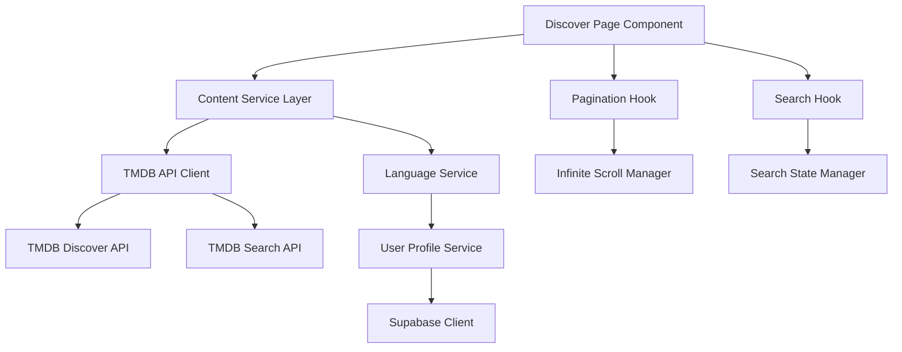

# Design Document

## Overview

This design enhances the existing discover page to provide comprehensive content discovery with pagination and advanced search capabilities. The solution will transform the current single-page content loading into a robust, paginated system that fetches all available movies and TV shows in the user's target language.

The design leverages the existing TMDB API integration and extends it with infinite scroll pagination, enhanced search functionality, and improved language-based filtering. The solution maintains the current UI/UX patterns while significantly improving the content discovery experience.

## Architecture

### High-Level Architecture



### Data Flow

1. **Initial Load**: User profile → Language detection → Content fetching → UI rendering
2. **Pagination**: Scroll detection → Next page request → Content append → UI update
3. **Search**: Search input → API request → Results replacement → Pagination reset
4. **Language Change**: Profile update → Content refetch → UI refresh

## Components and Interfaces

### Enhanced Discover Page Component

The main component will be refactored to support:

```typescript
interface DiscoverPageState {
  content: ContentItem[];
  loading: boolean;
  error: string | null;
  hasNextPage: boolean;
  currentPage: number;
  searchQuery: string;
  selectedFilter: 'all' | 'movies' | 'tv';
  userLanguage: string;
  isSearchMode: boolean;
}

interface ContentItem {
  id: number;
  title: string;
  name?: string;
  type: 'movie' | 'tv';
  poster_path: string;
  backdrop_path: string;
  overview: string;
  release_date?: string;
  first_air_date?: string;
  vote_average?: number;
  original_language: string;
}
```

### Content Service Layer

A new service layer will handle all TMDB API interactions:

```typescript
interface ContentService {
  discoverContent(params: DiscoverParams): Promise<ContentResponse>;
  searchContent(params: SearchParams): Promise<ContentResponse>;
  getLanguageMapping(language: string): LanguageMapping;
}

interface DiscoverParams {
  language: string;
  originalLanguage: string;
  page: number;
  contentType?: 'movie' | 'tv' | 'all';
}

interface SearchParams {
  query: string;
  language: string;
  page: number;
  contentType?: 'movie' | 'tv' | 'all';
}

interface ContentResponse {
  results: ContentItem[];
  totalPages: number;
  totalResults: number;
  page: number;
}
```

### Pagination Hook

A custom hook to manage infinite scroll pagination:

```typescript
interface UsePaginationReturn {
  items: ContentItem[];
  loading: boolean;
  hasNextPage: boolean;
  loadNextPage: () => void;
  reset: () => void;
  error: string | null;
}

function usePagination(
  fetchFunction: (page: number) => Promise<ContentResponse>,
  dependencies: any[]
): UsePaginationReturn;
```

### Search Hook

A custom hook to manage search functionality:

```typescript
interface UseSearchReturn {
  searchQuery: string;
  setSearchQuery: (query: string) => void;
  searchResults: ContentItem[];
  isSearching: boolean;
  searchError: string | null;
  clearSearch: () => void;
}

function useSearch(
  searchFunction: (query: string, page: number) => Promise<ContentResponse>,
  debounceMs: number = 300
): UseSearchReturn;
```

## Data Models

### Enhanced Content Models

```typescript
// Extended from existing Movie interface
interface EnhancedMovie extends Movie {
  original_language: string;
  spoken_languages?: Language[];
  content_type: 'movie';
}

// Extended from existing TVShow interface  
interface EnhancedTVShow extends TVShow {
  original_language: string;
  spoken_languages?: Language[];
  content_type: 'tv';
}

interface Language {
  iso_639_1: string;
  english_name: string;
  name: string;
}

// Unified content type for display
type UnifiedContent = EnhancedMovie | EnhancedTVShow;
```

### API Response Models

```typescript
interface TMDBDiscoverResponse {
  page: number;
  results: (Movie | TVShow)[];
  total_pages: number;
  total_results: number;
}

interface TMDBSearchResponse {
  page: number;
  results: SearchResult[];
  total_pages: number;
  total_results: number;
}

interface SearchResult {
  id: number;
  media_type: 'movie' | 'tv';
  title?: string;
  name?: string;
  overview: string;
  poster_path: string;
  backdrop_path: string;
  release_date?: string;
  first_air_date?: string;
  original_language: string;
}
```

## Implementation Strategy

### Phase 1: Content Service Layer
- Create `ContentService` class with TMDB API integration
- Implement language mapping and filtering logic
- Add error handling and retry mechanisms

### Phase 2: Pagination System
- Implement `usePagination` hook with infinite scroll
- Add intersection observer for scroll detection
- Implement loading states and error handling

### Phase 3: Search Enhancement
- Create `useSearch` hook with debouncing
- Implement search API integration
- Add search result pagination

### Phase 4: UI Integration
- Refactor discover page to use new hooks
- Add loading indicators for pagination
- Implement search/browse mode switching

### Phase 5: Language Integration
- Enhance language detection from user profile
- Implement dynamic language switching
- Add language preference persistence

## API Integration Details

### TMDB Discover API Usage

```typescript
// For movies in target language
const discoverMoviesUrl = `https://api.themoviedb.org/3/discover/movie?api_key=${API_KEY}&language=${languageCode}&with_original_language=${originalLanguageCode}&sort_by=popularity.desc&page=${page}`;

// For TV shows in target language
const discoverTVUrl = `https://api.themoviedb.org/3/discover/tv?api_key=${API_KEY}&language=${languageCode}&with_original_language=${originalLanguageCode}&sort_by=popularity.desc&page=${page}`;
```

### TMDB Search API Usage

```typescript
// Multi-search for both movies and TV shows
const searchUrl = `https://api.themoviedb.org/3/search/multi?api_key=${API_KEY}&language=${languageCode}&query=${encodeURIComponent(query)}&page=${page}`;

// Filtered search for specific content type
const searchMoviesUrl = `https://api.themoviedb.org/3/search/movie?api_key=${API_KEY}&language=${languageCode}&query=${encodeURIComponent(query)}&page=${page}`;
```

### Language Filtering Strategy

1. **Primary Filter**: Content originally in target language (`with_original_language`)
2. **Secondary Filter**: Content with target language available (via language detection)
3. **Fallback**: Popular content with subtitle/dubbing availability

## Error Handling

### API Error Scenarios
- Network connectivity issues
- TMDB API rate limiting
- Invalid API responses
- Missing content data

### Error Recovery Strategies
- Exponential backoff for retries
- Graceful degradation to cached content
- User-friendly error messages
- Retry mechanisms for failed requests

### Loading States
- Initial page load skeleton
- Pagination loading indicators
- Search loading states
- Error state displays

## Testing Strategy

### Unit Tests
- Content service API integration
- Pagination hook functionality
- Search hook debouncing and state management
- Language mapping utilities

### Integration Tests
- End-to-end content discovery flow
- Search and pagination interaction
- Language switching scenarios
- Error handling and recovery

### Performance Tests
- Large dataset pagination performance
- Search response time optimization
- Memory usage with infinite scroll
- API rate limiting compliance

## Performance Considerations

### Optimization Strategies
- Implement virtual scrolling for large datasets
- Cache API responses with appropriate TTL
- Debounce search queries to reduce API calls
- Lazy load images with intersection observer

### Memory Management
- Implement content virtualization for infinite scroll
- Clear old content when memory threshold reached
- Optimize image loading and caching
- Monitor component re-render performance

### API Efficiency
- Batch API requests where possible
- Implement request deduplication
- Use appropriate page sizes (20 items per page)
- Cache language mappings and user preferences